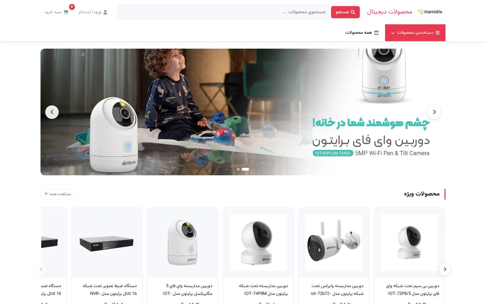
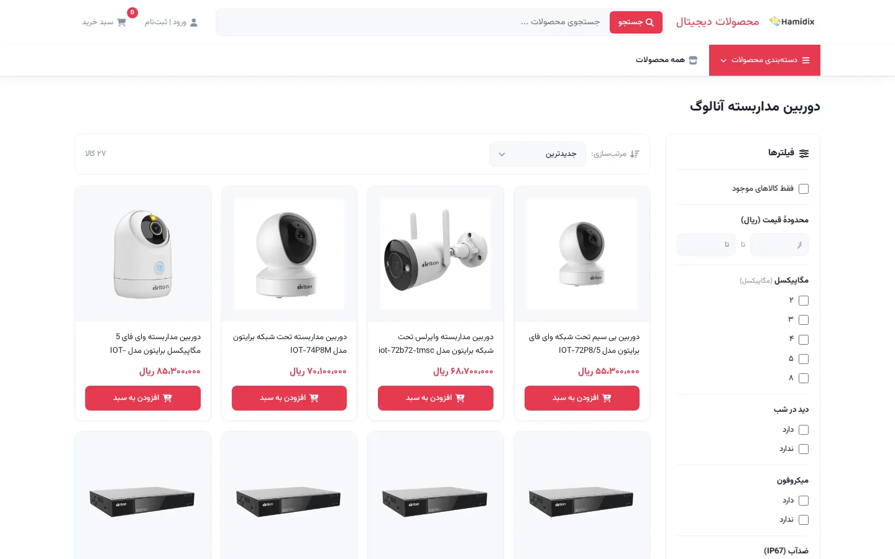
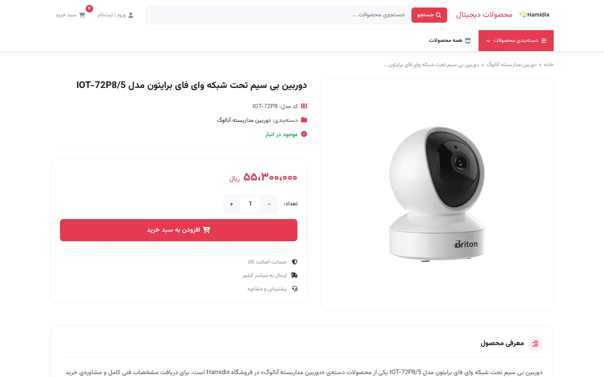
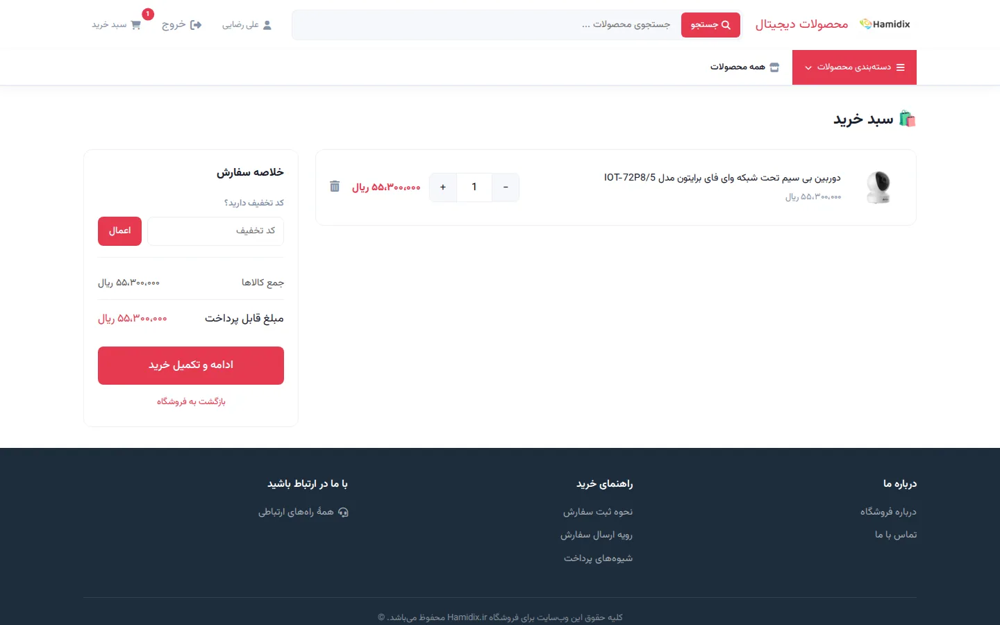
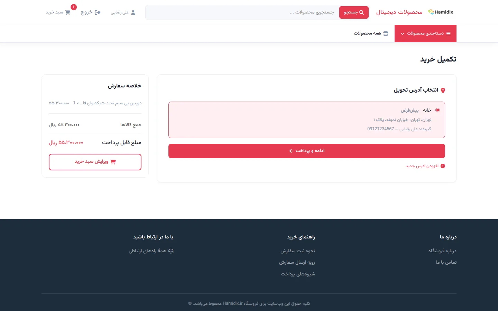
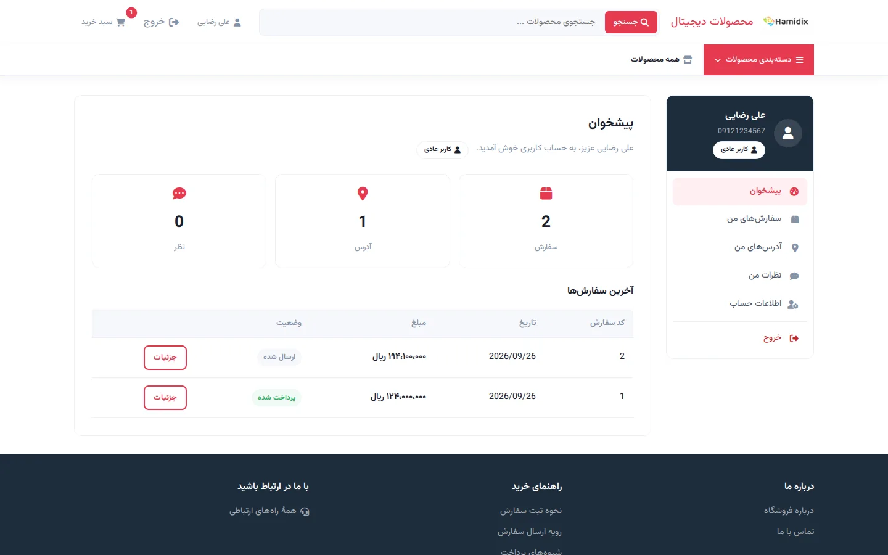
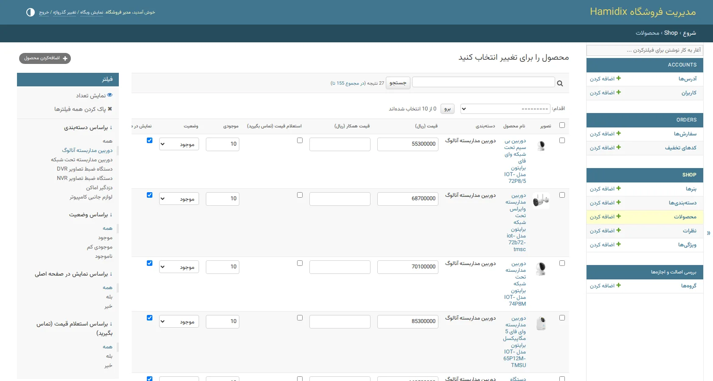
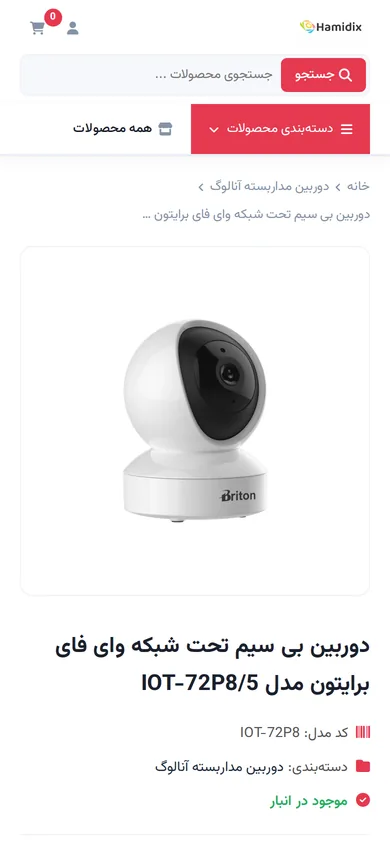

# Hamidix

<p align="center">
  
</p>

<p align="center">
  <b>فروشگاه اینترنتی دوربین مداربسته و لوازم جانبی</b><br>
  An online store for CCTV cameras and accessories, built with Django
</p>

<p align="center">
  <a href="#فارسی">فارسی</a> · <a href="#english">English</a>
</p>

---

<div dir="rtl">

## فارسی

### این پروژه چیه؟

Hamidix یه فروشگاه اینترنتیه که برای فروش دوربین مداربسته، دستگاه‌های ضبط DVR و NVR، دزدگیر
و لوازم جانبی کامپیوتر ساختمش. اولش چند تا صفحه‌ی HTML ساده بود که محصولات دستی توشون نوشته
می‌شد و با هر تغییر قیمت باید کد رو عوض می‌کردیم. بعد کل پروژه رو با جنگو از نو نوشتم تا
محصولات، سفارش‌ها و کاربرها از پنل مدیریت کنترل بشن و دیگه لازم نباشه برای هر تغییر کوچیک
دست به کد بزنیم.

الان سایت همه‌ی چیزهایی که یه فروشگاه واقعی لازم داره رو داره: دسته‌بندی و فیلتر محصولات،
سبد خرید، کد تخفیف، ثبت سفارش، پرداخت آنلاین و پنل کاربری. مدیر فروشگاه هم همه‌چیز رو از
پنل مدیریت فارسی کنترل می‌کنه.

### امکانات

**برای مشتری**

- ورود و ثبت‌نام با شماره موبایل، و بازیابی رمز عبور با ایمیل
- دسته‌بندی محصولات و جستجو بین اسم، کد مدل و توضیحات
- فیلتر پویا بر اساس ویژگی‌ها (مثل مگاپیکسل، دید در شب، میکروفون)، بازه‌ی قیمت و موجودی
- مرتب‌سازی بر اساس جدیدترین، پرفروش‌ترین، محبوب‌ترین، ارزان‌ترین و گران‌ترین
- صفحه‌ی محصول با گالری تصاویر، زوم روی عکس، جدول مشخصات فنی و محصولات مرتبط
- ثبت نظر و امتیاز برای محصولات (بعد از تأیید مدیر نمایش داده می‌شه)
- سبد خرید که بدون رفرش صفحه به‌روز می‌شه
- کد تخفیف درصدی یا مبلغ ثابت
- ذخیره‌ی چند آدرس و انتخاب یکی موقع خرید
- پرداخت آنلاین از طریق درگاه
- پنل کاربری: پیشخوان، سفارش‌ها، آدرس‌ها، نظرها و ویرایش حساب
- دیدن کد رهگیری پستی سفارش بعد از ارسال
- طراحی راست‌چین و واکنش‌گرا که روی موبایل هم درست کار می‌کنه

**برای مدیر فروشگاه**

- پنل مدیریت سفارشی و فارسی با فونت وزیرمتن
- تغییر سریع قیمت، قیمت همکار و موجودی مستقیم از جدول محصولات
- دیدن تصویر کوچک محصول و بنر توی لیست‌ها
- مدیریت بنرهای اسلایدر صفحه‌ی اصلی و بنرهای تبلیغاتی
- ساخت ویژگی‌های دلخواه برای هر دسته‌بندی که هم فیلتر می‌سازن و هم جدول مشخصات
- قیمت جداگانه برای «همکار»‌ها: کاربری که نقش همکار داره قیمت همکاری رو می‌بینه
- حالت «استعلام قیمت» برای کالاهایی که قیمتشون ثابت نیست
- مدیریت سفارش‌ها، تغییر وضعیت و ثبت کد رهگیری از همون لیست
- تعریف کد تخفیف با تاریخ شروع و پایان، حداقل مبلغ خرید و سقف تعداد استفاده
- تأیید یا رد نظر کاربرها
- وقتی پرداخت تأیید بشه، موجودی کالاها خودکار کم می‌شه

**امنیت**

- محدود کردن تلاش‌های ناموفق ورود (بعد از ۵ بار، ۱۵ دقیقه قفل)
- جلوگیری از ریدایرکت به سایت‌های دیگه (open redirect)
- خروج از حساب فقط با درخواست POST
- هر کاربر فقط سفارش‌ها و آدرس‌های خودش رو می‌بینه
- هدرهای امنیتی مثل CSP و HSTS
- رمزها، کلیدها و اطلاعات فروشگاه فقط توی فایل `.env` هستن و وارد مخزن نمی‌شن

### تکنولوژی‌ها

| بخش | ابزار |
|-----|-------|
| بک‌اند | Python، Django 5.2 (با Class-Based View) |
| فرانت‌اند | HTML5، CSS3، JavaScript (بدون فریم‌ورک)، قالب‌های جنگو |
| دیتابیس | SQLite برای توسعه، MySQL/MariaDB برای سرور (با PyMySQL) |
| فایل‌های استاتیک | WhiteNoise |
| تصاویر | Pillow |
| آیکن و فونت | Font Awesome، فونت وزیرمتن |
| تنظیمات | python-dotenv |
| کیفیت کد | Ruff، تست‌های جنگو، GitHub Actions |

### تصاویر

| صفحه‌ی دسته‌بندی و فیلترها | صفحه‌ی محصول |
|:---:|:---:|
|  |  |
| **سبد خرید** | **تکمیل خرید** |
|  |  |
| **پنل کاربری** | **پنل مدیریت** |
|  |  |

| نسخه‌ی موبایل | |
|:---:|:---:|
|  |  |

### اجرا روی سیستم خودتون

به Python 3.10 یا بالاتر نیاز دارید.

</div>

```bash
git clone https://github.com/alisamadzadeh46/Hmidix.git
cd Hmidix

python -m venv .venv
# Windows:
.venv\Scripts\activate
# Linux / macOS:
source .venv/bin/activate

pip install -r requirements.txt
cp .env.example .env        # on Windows: copy .env.example .env

python manage.py migrate
python manage.py seed_products      # sample products
python manage.py seed_attributes    # sample filters and specs
python manage.py createsuperuser --phone 09120000000
python manage.py runserver
```

<div dir="rtl">

حالا سایت روی `http://127.0.0.1:8000` بالا میاد. آدرس پنل مدیریت توی `config/urls.py`
تعریف شده و با همون شماره و رمزی که برای `createsuperuser` دادید وارد می‌شید.

اگه روی ویندوز موقع اجرای دستورها خطای encoding گرفتید، قبلش `set PYTHONUTF8=1` رو بزنید.

### تنظیمات

همه‌ی تنظیمات از فایل `.env` خونده می‌شن و نمونه‌ی کاملش توی `.env.example` هست. چند تا از
مهم‌هاش:

| متغیر | کاربرد |
|-------|--------|
| `SECRET_KEY`، `DEBUG`، `ALLOWED_HOSTS` | تنظیمات اصلی جنگو. روی سرور `DEBUG=False` باشه |
| `DB_ENGINE` و `DB_*` | `sqlite` برای توسعه، `mysql` برای سرور |
| `STORE_PHONE`، `STORE_ADDRESS` و `STORE_*` | شماره، آدرس و شبکه‌های اجتماعی فروشگاه. هرکدوم خالی باشه نمایش داده نمی‌شه |
| `ENAMAD_ID`، `ENAMAD_CODE` | نماد اعتماد الکترونیکی |
| `PAYMENT_GATEWAY`، `ZARINPAL_MERCHANT_ID` | ماژول درگاه پرداخت و کد پذیرنده |
| `DEPLOY_*` | اطلاعات سرور برای اسکریپت `deploy.py` |

### درگاه پرداخت

کد سفارش به درگاه خاصی وابسته نیست. ماژول درگاه با `PAYMENT_GATEWAY` انتخاب می‌شه و فقط کافیه
سه تا تابع `payment_request`، `payment_verify` و `gateway_url` داشته باشه. توضیح کاملش توی
`orders/payments.py` هست و یه نمونه‌ی ساده هم توی `orders/tests/fake_gateway.py` گذاشتم. پس
اگه بخواید درگاه رو عوض کنید، فقط یه ماژول جدید می‌نویسید و مسیرش رو توی `.env` عوض می‌کنید.

### راه‌اندازی روی سرور

1. یه دیتابیس MySQL با charset `utf8mb4` بسازید.
2. فایل `.env` رو روی سرور بسازید، `DEBUG=False` و `DB_ENGINE=mysql` بذارید و بقیه رو پر کنید.
3. این دستورها رو اجرا کنید:

</div>

```bash
pip install -r requirements.txt
python manage.py migrate
python manage.py collectstatic --noinput
python manage.py createsuperuser --phone 09120000000
```

<div dir="rtl">

در آخر هم سایت رو با Gunicorn یا Passenger اجرا کنید. نقطه‌ی ورودش `config.wsgi:application` هست.

فایل‌های استاتیک رو خود WhiteNoise سرو می‌کنه، ولی عکس‌هایی که از پنل آپلود می‌شن توی `media/`
ذخیره می‌شن و وب‌سرور باید اون پوشه رو سرو کنه.

برای آپدیت‌های بعدی می‌تونید از `deploy.py` استفاده کنید. فقط فایل‌هایی که عوض شدن رو آپلود
می‌کنه، بعد migrate و collectstatic رو اجرا می‌کنه و سرویس رو ری‌استارت می‌کنه. دفعه‌ی اول که به
یه سرور جدید وصل می‌شید، `DEPLOY_TRUST_NEW_HOST=true` رو بذارید تا کلید سرور ذخیره بشه.

### تست

</div>

```bash
pip install -r requirements-dev.txt
ruff check .
python manage.py test
```

<div dir="rtl">

همین دستورها با هر push روی GitHub Actions هم اجرا می‌شن.

### ساختار پروژه

</div>

```
accounts/   users, phone login, addresses, profile pages
shop/       categories, products, attributes, banners, reviews
orders/     cart, coupons, checkout, orders, payment gateway interface
core/       helpers shared between apps
config/     settings, URLs, security headers
templates/  Django templates
static/     CSS, JavaScript, images, fonts
_legacy/    old static pages, used only by the seed_products command
deploy.py   incremental deploy script
```

---

## English

### What is this?

Hamidix is an online store I built for selling CCTV cameras, DVR and NVR recorders, burglar alarms
and computer accessories. It started as a handful of static HTML pages where every product was
typed in by hand, so each price change meant editing code. I rewrote the whole thing in Django so
products, orders and customers are managed from an admin panel instead.

It now covers what a real shop needs: categories and filters, a cart, discount codes, checkout,
online payment and a customer dashboard. The store owner runs everything from a Persian admin panel.

### Features

**For customers**

- Sign up and log in with a mobile number; reset forgotten passwords by email
- Browse by category, or search product names, model codes and descriptions
- Dynamic filters by attributes (megapixels, night vision, microphone, ...), price range and stock
- Sort by newest, best-selling, most reviewed, cheapest or most expensive
- Product pages with an image gallery, hover zoom, a specs table and related products
- Reviews and ratings, published after the admin approves them
- A cart that updates without reloading the page
- Percentage or fixed-amount discount codes
- Several saved addresses, one of which is picked at checkout
- Online payment through a payment gateway
- A dashboard with orders, addresses, reviews and account settings
- Postal tracking code shown on the order once it ships
- Right-to-left, responsive layout that works on phones

**For the store owner**

- A customized Persian admin panel using the Vazirmatn font
- Edit prices, wholesale prices and stock right from the product list
- Thumbnails for products and banners in the admin lists
- Manage the home page slider and promotional banners
- Define custom attributes per category; they drive both the filters and the specs table
- Separate "colleague" (wholesale) pricing for users with that role
- A "call for price" mode for products with volatile prices
- Update order status and add tracking codes from the order list
- Discount codes with start/end dates, a minimum order amount and a usage limit
- Approve or reject customer reviews
- Stock is deducted automatically when a payment is verified

**Security**

- Login throttling (5 failed attempts lock the number for 15 minutes)
- Protection against open redirects
- Logout only through POST requests
- Customers can only see their own orders and addresses
- Security headers such as CSP and HSTS
- Secrets, keys and store details live only in `.env`, never in the repository

### Tech stack

| Area | Tools |
|------|-------|
| Backend | Python, Django 5.2 (class-based views) |
| Frontend | HTML5, CSS3, vanilla JavaScript, Django templates |
| Database | SQLite for development, MySQL/MariaDB in production (via PyMySQL) |
| Static files | WhiteNoise |
| Images | Pillow |
| Icons & fonts | Font Awesome, Vazirmatn |
| Configuration | python-dotenv |
| Code quality | Ruff, Django test runner, GitHub Actions |

### Running it locally

You need Python 3.10 or newer. Run the commands from the
[Persian section](#اجرا-روی-سیستم-خودتون) above; they are the same. After that the site is
available at `http://127.0.0.1:8000`. The admin URL is defined in `config/urls.py`; log in with the
phone number and password you gave to `createsuperuser`.

On Windows, if a command fails with an encoding error, run `set PYTHONUTF8=1` first.

### Configuration

Everything is read from `.env`; `.env.example` lists every option. The important ones:

| Variable | Purpose |
|----------|---------|
| `SECRET_KEY`, `DEBUG`, `ALLOWED_HOSTS` | Core Django settings. Use `DEBUG=False` in production |
| `DB_ENGINE` and `DB_*` | `sqlite` for development, `mysql` for production |
| `STORE_PHONE`, `STORE_ADDRESS`, `STORE_*` | Store phone, address and social handles. Empty values are simply hidden |
| `ENAMAD_ID`, `ENAMAD_CODE` | e-Namad trust seal |
| `PAYMENT_GATEWAY`, `ZARINPAL_MERCHANT_ID` | Payment gateway module and merchant ID |
| `DEPLOY_*` | Server details for `deploy.py` |

### Payment gateway

The order code isn't tied to one provider. `PAYMENT_GATEWAY` points to a module that exposes
three functions: `payment_request`, `payment_verify` and `gateway_url`. The contract is documented
in `orders/payments.py`, and `orders/tests/fake_gateway.py` is a minimal example. Switching
providers means writing one module and changing one line in `.env`.

### Deploying

1. Create a MySQL database with the `utf8mb4` charset.
2. Create `.env` on the server with `DEBUG=False`, `DB_ENGINE=mysql` and the other values.
3. Run `migrate`, `collectstatic` and `createsuperuser` (see the commands in the Persian section).
4. Serve `config.wsgi:application` with Gunicorn or Passenger.

WhiteNoise serves the static files. Uploaded images go to `media/`, which your web server has to
serve.

For later updates there is `deploy.py`. It uploads only the files that changed, runs migrations and
`collectstatic`, then restarts the service. On the first deploy to a new server set
`DEPLOY_TRUST_NEW_HOST=true` once so the server's host key gets saved.

### Tests

```bash
pip install -r requirements-dev.txt
ruff check .
python manage.py test
```

The same checks run on every push through GitHub Actions.

---

Developed by [alisamadzadeh](https://github.com/alisamadzadeh46)
